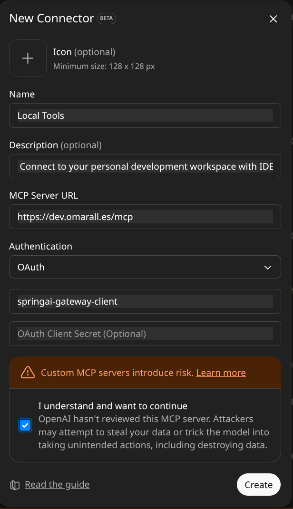

# ChatGPT — Register the MCP Gateway (OAuth 2.1 + PKCE)

This branch uses Authorization Code + PKCE with a public client (no secret) to integrate the gateway with ChatGPT Connectors.

## Prerequisites
- `auth-server` and `mcp-gateway` running on ports `9090` and `8080` respectively.
- Cloudflare tunnel operational and public domain (e.g., `https://dev.omarall.es`).
- The `issuer` of the Authorization Server matches the public domain.
  - File: `auth-server/src/main/resources/application.yml` (property `spring.security.oauth2.authorizationserver.issuer`).
  - File: `mcp-gateway/src/main/resources/application.yml` (property `spring.security.oauth2.resourceserver.jwt.issuer-uri`).

## Steps in ChatGPT (Developer Mode)
1. Enable **Developer Mode** in ChatGPT.
2. Go to **Settings → Connectors → Create**.

 

> ChatGPT manages token acquisition and renewal automatically. You ll be required to authenticate during the first connection.

## Troubleshooting
- 401/invalid_token: check `issuer` and system clock.
- redirect_uri_mismatch: confirm that `https://chatgpt.com/connector_platform_oauth_redirect` is in `redirect-uris` of the client.
- Tunnel domain: verify that the `hostname` of the tunnel matches the configured `issuer`.