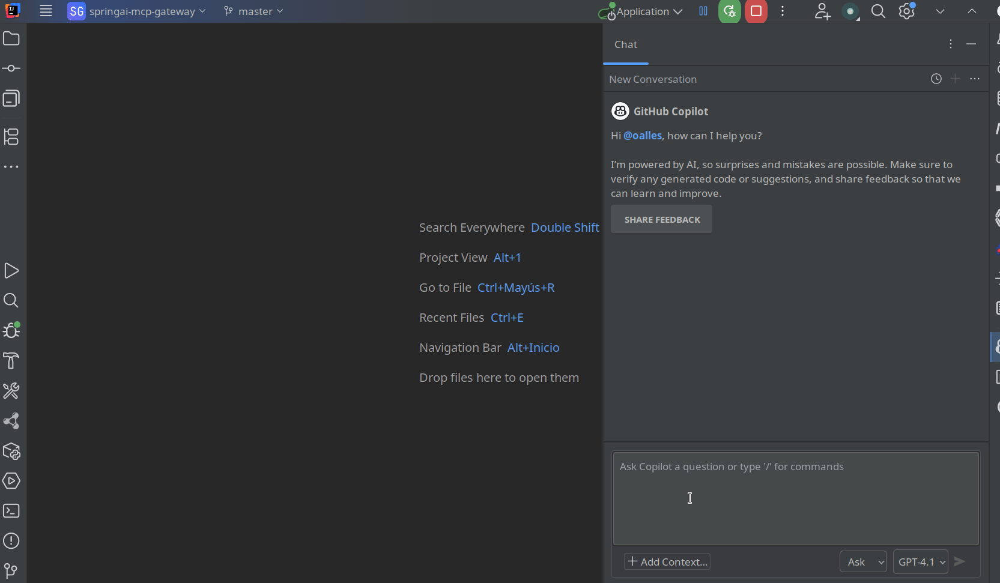

# Spring AI MCP Gateway

## General Description

This project is a gateway/extension for Spring AI MCP (Model Context Protocol), built with Spring Boot 3 and Maven. Its purpose is to act as a bridge between MCP clients and servers, allowing the management, discovery, and exposure of AI tools via HTTP endpoints, with support for prefixes and advanced configuration.

## Main Components

- **Application.java**: Main class that starts the Spring Boot application, enabling custom property configuration.
- **CatalogHttpController.java**: REST controller that exposes the `/mcp/gateway/catalog` endpoint to list all available tools in the gateway.
- **GatewayProvidersConfig.java**: Bean configuration that defines the ToolCallbacks provider, integrating synchronous and asynchronous MCP clients, and applying prefix logic to tool names.
- **McpGatewayProperties.java**: Configurable properties of the gateway, such as prefix mode, delimiter, static prefix, and timeout.
- **PrefixedToolCallback.java / PrefixedToolDefinition.java**: Wrappers to apply prefixes to tool names, avoiding collisions and allowing better organization and discovery.

## Integration with Spring AI MCP

The gateway uses the Spring AI MCP client and server starters, allowing:
- Centralized discovery and exposure of MCP tools.
- Configuration of prefix behavior to avoid name collisions.
- Support for both synchronous and asynchronous clients.
- Exposure of HTTP endpoints for querying available tools.

## Configuration

The main configuration is located in `src/main/resources/application.yml`, where the parameters for the MCP server and client are defined, including:
- Transport type (SYNC/ASYNC, WEBFLUX, etc.)
- Request timeouts
- Prefixes and delimiters for tool names
- Connections to external tools (memory, duckduckgo, etc.)

Example configuration:

```yaml
server:
  port: 9090
spring:
  ai:
    mcp:
      server:
        enabled: true
        type: ASYNC
        transport: WEBFLUX
        request-timeout: 30s
      client:
        enabled: true
        name: mcp-client
        version: 1.0.0
        request-timeout: 30s
        type: SYNC
```

## Endpoints

- `GET /mcp/gateway/catalog`: Returns the catalog of tools available in the gateway in JSON format.

## Connecting the MCP Gateway to GitHub Copilot

GitHub Copilot can connect directly to your custom MCP server, enabling you to extend Copilot with domain-specific tools and resources. To achieve this, we use the `mcp-remote` script, which acts as a lightweight CLI client for MCP servers. It establishes a session with your MCP server, lists the available tools and resources, and lets Copilot interact with them as if they were built-in capabilities.

The configuration is managed through the `mcp.json` file, which for IntelliJ is located at:

```plain text
~/.config/github-copilot/intellij/mcp.json
```

Here is the example configuration for connecting to the MCP Gateway running at `http://localhost:9090/sse`:

```json
{
  "servers": {
    "springai-mcp-gw": {
      "command": "/npx",
      "args": [
        "mcp-remote",
        "http://localhost:9090/sse"
      ]
    }
  }
}
```

With this setup:

* `mcp-remote` establishes a connection between Copilot and your MCP Gateway.

* Copilot can **discover and invoke tools** exposed by your server.

* It provides a clean way to **test and integrate MCP endpoints** without writing a custom client.

In short, mcp-remote bridges GitHub Copilot with your MCP Gateway, so you can seamlessly enhance your development 
workflow by exposing custom functionality directly to Copilot inside IntelliJ.

## Takeaway

There is a robust, Docker-backed MCP Gateway designed for security, manageability, and scale.

This Spring AI MCP gateway is just a didactic example.

For production environments, the Docker MCP Gateway provides a governed, observable, and scalable control plane for your MCP ecosystem.
See the [Docker MCP Gateway documentation](docker-mcp-gateway.md) for more details.


## Running and Testing Your MCP Gateway

Before connecting GitHub Copilot, you can run and test your MCP Gateway locally to ensure everything is working as expected.

To start the project, simply use Maven:

```sh
mvn spring-boot:run
```

This will launch the MCP Gateway server, typically on port 9090 (unless configured otherwise).

You can then manually interact with your MCP Gateway using the official MCP CLI utility. For example, you can run:

```sh
npx mcp-remote http://localhost:9090/sse
```

This command connects to your local MCP Gateway via the Server-Sent Events (SSE) endpoint. It allows you to send tool requests and receive responses directly from the command line, simulating how an AI client (like Copilot) would interact with your gateway.


## Connecting GitHub Copilot to Your MCP Gateway

Now for the fun part: using GitHub Copilot with the new gateway. Recent versions of GitHub Copilot (especially in IDEs like VS Code and JetBrains IDEs) have
experimental support for connecting to **custom MCP servers**. This allows Copilot to call your tools (MCP tools) as it’s generating code or answers –
effectively letting Copilot act as a more powerful AI pair programmer with access to your specific resources.

To connect Copilot to an MCP server, GitHub provides a small CLI utility called mcp-remote (distributed via npm). The Copilot IDE0 plugins
look for an MCP configuration file to know how to launch this utility. For example, in JetBrains IDEs (IntelliJ, etc.), you can create a file
at `~/.config/github-copilot/intellij/mcp.json`. Here’s how we set ours up to point to the locally running Spring MCP Gateway:

```json
{
  "servers": {
    "springai-mcp-gw": {
      "command": "/npx",
      "args": [ "mcp-remote", "http://localhost:9090/sse" ]
    }
  }
}
```

Let’s break that down: we define a server profile named "springai-mcp-gw" (you can call it anything). The Copilot plugin will
use the specified command to connect – in our case we use npx to run the mcp-remote package, pointing it to our gateway’s SSE URL (http://localhost:9090/sse).
Once this is set up, we can instruct Copilot to connect to our server. Copilot (through `mcp-remote`) will then:

* Establish a session with the MCP Gateway.
* Retrieve the list of available tools (the ones we saw in the catalog, now prefixed and aggregated).
* Start listening for and forwarding tool calls. Essentially, mcp-remote acts as a bridge between the Copilot AI running in the cloud and your local MCP server.

With the connection live, Copilot can invoke your tools as needed.




## References

- [Spring AI MCP Overview](https://docs.spring.io/spring-ai/reference/api/mcp/mcp-overview.html)
- [Spring AI MCP Client Boot Starter](https://docs.spring.io/spring-ai/reference/api/mcp/mcp-client-boot-starter-docs.html)
- [Spring AI MCP Server Boot Starter](https://docs.spring.io/spring-ai/reference/api/mcp/mcp-server-boot-starter-docs.html)

## Getting Started

### Reference Documentation

For more information, see:

* [Official Apache Maven Documentation](https://maven.apache.org/guides/index.html)
* [Spring Boot Maven Plugin Guide](https://docs.spring.io/spring-boot/3.5.4/maven-plugin)
* [Create an OCI image](https://docs.spring.io/spring-boot/3.5.4/maven-plugin/build-image.html)

