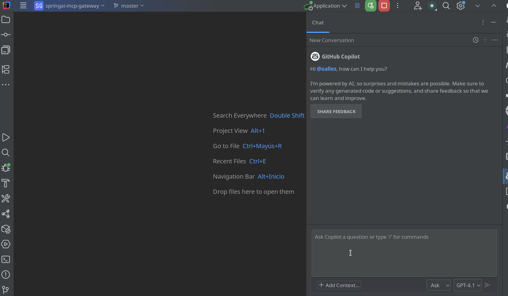

# Spring AI MCP Gateway (Streamable HTTP + OAuth 2.1)

This repository hosts a multi‑module Spring Boot project that implements an MCP Gateway using Spring AI and secures it
with OAuth 2.1. In this branch (OAUTH2.1_STREAMABLE) the server transport has been migrated from SSE to Streamable HTTP
and the project has been split into two modules:

- `auth-server/` – OAuth 2.1 Authorization Server (JWT issuer) on port 9090.
- `mcp-gateway/` – Spring AI MCP server/client acting as a Resource Server on port 8080.

As a result, the MCP endpoint is now available at `http://localhost:8080/mcp` and requires a Bearer token issued by the
Authorization Server at `http://localhost:9090`.

## Branch History

This repository uses branches to illustrate the evolution of repo:

- NO_AUTH_SSE — anchor for “SSE without security”

- OAUTH2.1_STREAMABLE — Streamable HTTP + OAuth 2.1 (current)
  - Transport switched to Streamable HTTP at `http://localhost:8080/mcp`.
  - Secured as an OAuth 2.1 Resource Server (issuer `http://localhost:9090`).
  - Maven multi-module: `auth-server/` (9090) + `mcp-gateway/` (8080).
  - Removed catalog HTTP endpoint; discovery is via MCP.
  - Quick check: `npx mcp-remote http://localhost:8080/mcp --header "Authorization: Bearer $TOKEN"`.

- CLOUDFLARE_TUNNELS — (Future) planned next step
  - Goal: securely expose `mcp-gateway` (8080) over a Cloudflare Tunnel for remote testing.
  - Topics: tunnel → 8080 mapping, token-protected access, origin restrictions, and `mcp-remote` examples with the public URL.

## What Changed From `NO_AUTH_SSE` to `OAUTH2.1_STREAMABLE`

- Switched transport: SSE (`/sse` on 9090) → Streamable HTTP (`/mcp` on 8080).
- Added OAuth 2.1 protection to the MCP server (Resource Server JWT validation).
- Introduced a Maven multi‑module layout with dedicated `auth-server` and `mcp-gateway` modules.
- Removed the old catalog controller; the gateway focuses on MCP endpoints only.

## Project Structure

- Parent aggregator POM (`pom.xml`, packaging `pom`).
- Modules:
    - `auth-server/` – Authorization server configuration and keys. Config:
      `auth-server/src/main/resources/application.yml` (port 9090).
    - `mcp-gateway/` – MCP Gateway server/client and security. Config:
      `mcp-gateway/src/main/resources/application.yml` (port 8080).

Key classes in `mcp-gateway/`:

- `es.omarall.mcp.gateway.McpGatewayApplication`
- `es.omarall.mcp.gateway.SecurityConfiguration`
- `es.omarall.mcp.gateway.GatewayProvidersConfig`
- `es.omarall.mcp.gateway.McpGatewayProperties`
- `es.omarall.mcp.gateway.PrefixedToolCallback` / `PrefixedToolDefinition`

## Build

- Build all modules: `mvn -q clean package`

## Run (Local)

1) Start the Authorization Server (port 9090):

- `mvn -q -pl auth-server spring-boot:run`

2) Start the MCP Gateway (port 8080):

- `mvn -q -pl mcp-gateway spring-boot:run`

## Get a Token (Client Credentials)

- Well‑known metadata: `http://localhost:9090/.well-known/openid-configuration`
- Obtain token:

```bash
curl -u springai-gateway-client:my-secret \
  -d "grant_type=client_credentials" \
  http://localhost:9090/oauth2/token

# Optional: capture with jq
TOKEN=$(curl -s -u springai-gateway-client:my-secret \
  -d "grant_type=client_credentials" \
  http://localhost:9090/oauth2/token | jq -r .access_token)
```

## Quick Check With mcp-remote

Use the Streamable HTTP endpoint and pass the Bearer token:

```bash
npx mcp-remote http://localhost:8080/mcp \
  --header "Authorization: Bearer $TOKEN"
```

If you don’t use `jq`, copy the `access_token` from the JSON response and substitute it in the command above.

## JetBrains GitHub Copilot (mcp.json)

Place this file at `~/.config/github-copilot/intellij/mcp.json` and inject the token via env var for safety:

```json
{
  "servers": {
    "springai-mcp-gw": {
      "command": "npx",
      "args": [
        "mcp-remote",
        "http://127.0.0.1:8080/mcp",
        "--header",
        "Authorization: Bearer ${AUTH_TOKEN}"
      ],
      "env": {
        "AUTH_TOKEN": "<paste access_token here>"
      }
    }
  }
}
```

## Configuration Snapshots

`mcp-gateway/src/main/resources/application.yml` (excerpt):

```yaml
server:
  port: 8080
spring:
  ai:
    mcp:
      server:
        enabled: true
        protocol: streamable
        name: ${spring.application.name}
      client:
        enabled: true
        name: mcp-client
        version: 1.0.0
  security:
    oauth2:
      resourceserver:
        jwt:
          issuer-uri: http://localhost:9090
mcp:
  gateway:
    prefixMode: STATIC
    delimiter: "_"
    staticPrefix: "gw"
```

`auth-server/src/main/resources/application.yml` (excerpt):

```yaml
server:
  port: 9090
spring:
  security:
    oauth2:
      authorizationserver:
        client:
          springai-gateway-client:
            registration:
              client-id: springai-gateway-client
              client-secret: "{noop}my-secret"
              client-authentication-methods: [ client_secret_basic ]
              authorization-grant-types: [ client_credentials ]
            token:
              access-token-time-to-live: 1h
```

## Notes

- The gateway no longer exposes a catalog REST endpoint; discovery happens through MCP.
- Do not commit real secrets. Override via env vars (e.g., `SPRING_SECURITY_OAUTH2_RESOURCESERVER_JWT_ISSUER_URI`,
  `SERVER_PORT`, `SPRING_AI_*`).
- Default local ports: 9090 (auth-server), 8080 (mcp-gateway).

## References

- Spring AI MCP intro and updates: see Spring blog posts (2025‑09‑16, 2025‑09‑19) and security (2025‑09‑30).
- Daniel Vega’s example on building an MCP server with Spring AI.
- Spring AI Reference: MCP Overview, Client Boot Starter, Server Boot Starter.

## Screenshots




## Links

* https://spring.io/blog/2025/09/16/spring-ai-mcp-intro-blog
* https://spring.io/blog/2025/09/19/spring-ai-1-1-0-M2-mcp-focused
* https://www.danvega.dev/blog/cyc-mcp-server-spring-ai
* https://github.com/spring-ai-community/mcp-security/
* https://spring.io/blog/2025/09/30/spring-ai-mcp-server-security
