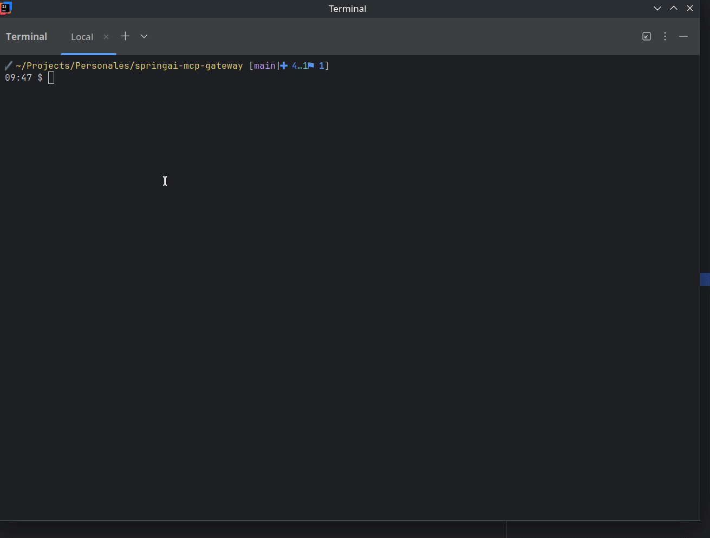

# Spring AI MCP Gateway (Streamable HTTP + OAuth 2.1)

Reference project that shows, end‑to‑end, how to configure:

- MCP clients: SSE (e.g., JetBrains Copilot) and stdio (Docker images `mcp/*`).
- MCP server: SSE and Streamable HTTP (the gateway exposes `/mcp`).
- Security modes: no auth, OAuth 2.1 with Client Credentials, and Authorization Code + PKCE (public client).

The goal is educational and practical: expose a local development environment so that ChatGPT can interact with it
through a simple MCP gateway. We also document how to publish it to the Internet using **Cloudflare Tunnels**
with path‑based routing—no reverse proxy in front of our services—and how to configure the ChatGPT Connector.

Important: this is not meant to be a production‑grade gateway. It’s a hands‑on reference that connects a few pieces to
deliver a very visual use‑case: “Let ChatGPT operate my dev environment”. For an operational, hardened gateway, see
`docker-mcp-gateway.md`.

Modules remain the same:

- `auth-server/` – OAuth 2.1 Authorization Server (JWT issuer) on port 9090.
- `mcp-gateway/` – Spring AI MCP server/client acting as a Resource Server on port 8080.

The public MCP endpoint is exposed at `https://<your-domain>/mcp` (through the tunnel) and protected with Bearer tokens
obtained by ChatGPT through the OAuth flow against the Authorization Server at `https://<your-domain>`.

## Scenarios & Branches

This repository uses branches to illustrate the evolution and the different auth modes:

- [NO_AUTH_SSE](https://github.com/oalles/springai-mcp-gateway/tree/NO_AUTH_SSE) — SSE without security. Minimal Spring AI setup and wiring. Github Copilot using the gateway at `http://localhost:8080/sse`.
- [OAUTH2.1_STREAMABLE](https://github.com/oalles/springai-mcp-gateway/tree/OAUTH2.1_STREAMABLE) — Streamable HTTP + OAuth 2.1 with Client Credentials (local issuer).
- [OAUTH2.1_CHATGPT_TUNNELS](https://github.com/oalles/springai-mcp-gateway/tree/OAUTH2.1_CHATGPT_TUNNELS) — ChatGPT Connectors + Cloudflare Tunnels + OAuth 2.1 (Authorization Code + PKCE, this branch)
  - Streamable HTTP at `/mcp` (Gateway on 8080). Multiple tools exposed through the same endpoint.
  - Public client (no secret), ChatGPT completes the OAuth flow and manages refresh tokens.
  - Single public hostname via Cloudflare Tunnel with path‑based routing. Resource Server validates JWTs from the public issuer.

## What Changed From `OAUTH2.1_STREAMABLE` to `OAUTH2.1_CHATGPT_TUNNELS`

- Authentication flow: from Client Credentials → Authorization Code + PKCE with a public client (no secret).
- Issuer and URLs: from `http://localhost:9090` → public `https://<your-domain>` through Cloudflare Tunnel.
- ChatGPT integration: the connector completes the OAuth flow and manages token refresh automatically.
- Resource Server keeps Streamable HTTP at `/mcp` and validates JWTs from the public issuer.

## Project Structure

- Parent aggregator POM (`pom.xml`, packaging `pom`).
- Modules:
    - `auth-server/` – Authorization server configuration and keys. Config:
      `auth-server/src/main/resources/application.yml` (port 9090).
    - `mcp-gateway/` – MCP Gateway server/client and security. Config:
      `mcp-gateway/src/main/resources/application.yml` (port 8080).

## Build

- Build all modules: `mvn -q clean package`

## Run (Local)

1) Start the Authorization Server (port 9090):

- `mvn -q -pl auth-server spring-boot:run`

2) Start the MCP Gateway (port 8080):

- `mvn -q -pl mcp-gateway spring-boot:run`

## Cloudflare Tunnel

- `cloudflared tunnel run mcp-gateway` # For Cloudflare Tunnel setup and path‑based routing, see [CLOUDFLARE.md](./CLOUDFLARE.md).

Traffic will be routed in my case, from  `https://dev.omarall.es`  to our local processes.   

## Register the Gateway in ChatGPT (OAuth 2.1 + PKCE)

See [CHATGPT](./CHATGPT.md) for detailed steps.

## ⚠️ Security Notes 

This repository is a learning and integration reference, just that.
Its goal is to demonstrate how to connect and configure Spring AI + MCP + OAuth 2.1.

Important security notes:

* **Do not use demo credentials in production**. The default in-memory user (omar/secret) is for local testing only.

* CORS and CSRF are relaxed for simplicity. Always restrict origins, allowed methods, and re-enable CSRF when building real deployments.

* Scopes (mcp:read, mcp:write) are defined for illustration only — enforce real scope-based authorization when applicable.

* Use HTTPS with verified domains and Zero Trust policies if publishing externally.

## Useful References

* https://spring.io/blog/2025/09/16/spring-ai-mcp-intro-blog
* https://spring.io/blog/2025/09/19/spring-ai-1-1-0-M2-mcp-focused
* https://www.danvega.dev/blog/cyc-mcp-server-spring-ai
* https://github.com/spring-ai-community/mcp-security/
* https://spring.io/blog/2025/09/30/spring-ai-mcp-server-security
* https://blog.christianposta.com/understanding-mcp-authorization-step-by-step/
* https://blog.christianposta.com/understanding-mcp-authorization-step-by-step-part-two/
* https://blog.christianposta.com/understanding-mcp-authorization-step-by-step-part-three/
* https://blog.christianposta.com/understanding-mcp-authorization-with-dynamic-client-registration/
* https://blog.christianposta.com/api-keys-are-a-bad-idea-for-enterprise-llm-agent-and-mcp-access/
